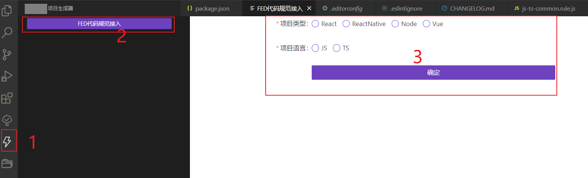

# fed-standard-config

## FED 最新代码规范 2022

[FED 前端代码规范](https://www.yuque.com/fengyinchao/awb51o/ksm7sc/edit)

## 接入指南

1、项目目录安装依赖  yarn add --dev @vigor/eslint-config-fed

2、安装 vscode 插件：vigor-fed-tools

3、然后按下图操作即可：

